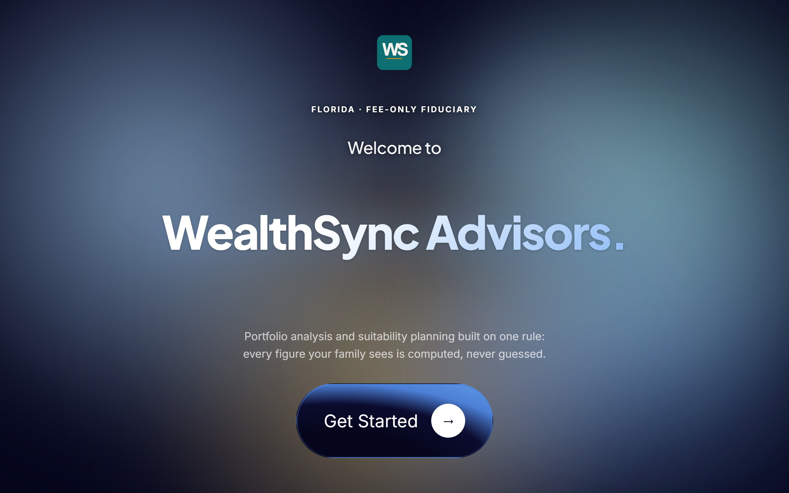
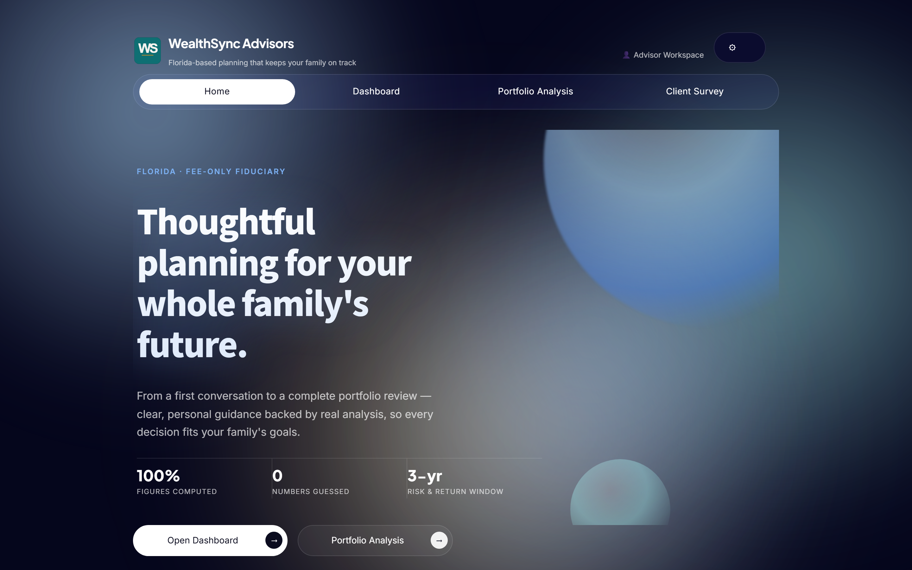
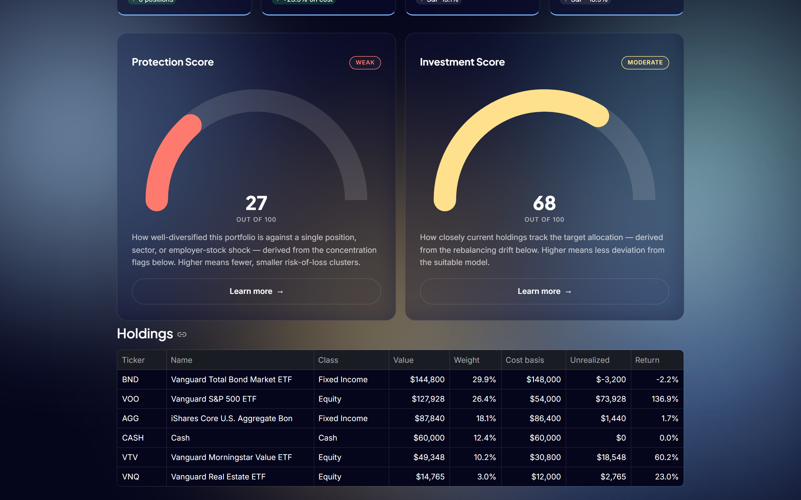
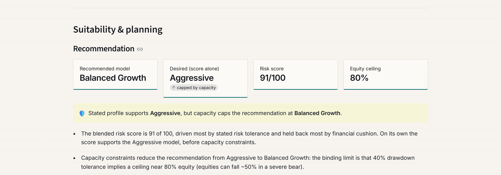
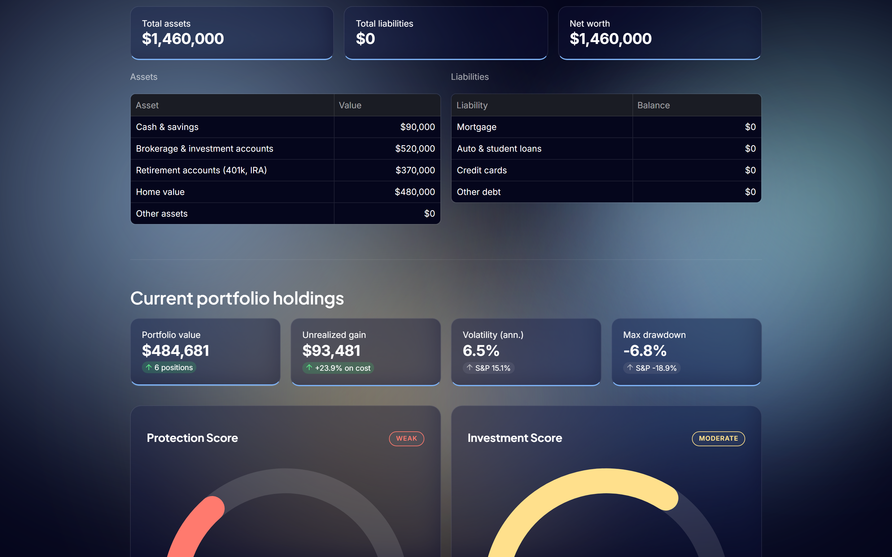

# WealthSync Advisors — portfolio-risk-agent

**Live app:** [wealthsync-advisors.streamlit.app](https://wealthsync-advisors.streamlit.app/)

A portfolio analysis and suitability engine for a fee-only fiduciary advisor,
built around one rule: **the language model never produces a number.** Every
figure — allocation, volatility, Sharpe ratio, tax cost, risk capacity — is
computed in Python from real price data. Two Claude agents sit downstream of
that math: one writes the client-facing narrative, a second, independent one
reviews it and flags any claim that doesn't trace back to a computed figure.
Full architecture below.




---

## What this is

Two chained capabilities, both driven by the same holdings/profile data:

1. **Portfolio analysis** — a holdings file → valuation, concentration
   (including fund look-through), volatility, Sharpe ratio, beta, max
   drawdown, and a tax-aware rebalancing plan, plus a downloadable
   client-ready HTML report.
2. **Suitability & planning** — a client intake survey → a **capacity-first**
   risk recommendation, retirement-income readiness, a sequence-of-returns
   stress test, structured-product suitability gating, and a downloadable
   Investment Policy Statement.

The CLI (below) runs capability 1 standalone against a CSV. The live web app
runs both, chained: a client's survey answers become the target model an
uploaded portfolio is measured against.

```bash
pra --portfolio data/sample_concentrated.csv --model balanced_growth --open
```

That produces a single self-contained HTML file, print-styled so
`Ctrl+P → Save as PDF` produces a document you could hand to a client.

---

## The AI architecture

```
  price data ──▶ analytics/ ──▶ computed metrics ─┬──▶ narrative agent ──▶ compliance agent ──▶ report
                (pure Python)                     │     (Claude Sonnet)    (Claude Haiku)
                                                  └──────────────────────────────────────────▶ report
                                                       every number passes through untouched
```

The narrative agent gets a **fact sheet** — every figure it's allowed to
mention, already computed and labeled — and a system prompt that forbids
inventing, estimating, or re-rounding anything not on that sheet. The
compliance agent gets the same fact sheet plus the draft, and checks it
independently: is every number traceable, is anything phrased as a
performance guarantee, does anything read as a specific buy/sell
recommendation. If it finds a problem, the report ships with the AI badge
**and the flag**, visible rather than silently corrected — the point is to
surface a failure, not paper over it.



No `ANTHROPIC_API_KEY` configured (or any failure in either agent) falls back
to a deterministic, rule-based narrative — same computed inputs, same
sentence structure, no model call at all. The badge tells you which path ran;
nothing about the report's numbers changes either way.

---

## Capacity-first suitability

The suitability engine's central design choice: a risk **score** captures
what a client *wants* (stated tolerance, objective, drawdown appetite); a
separate **capacity** ceiling — drawdown tolerance, time horizon, withdrawal
rate, emergency reserve, age — caps what they can actually *bear*. Capacity
can only cap the score's recommendation downward, never raise it, and the
report always names the binding constraint.



Here the client's stated answers score as Aggressive, but a 40% drawdown
tolerance implies an 80% equity ceiling — not a further constraint in this
case, but for a client with a thin cash reserve or a five-year horizon, the
same mechanism caps the recommendation well below what their stated appetite
alone would produce.

---

## What the analytics actually catch

Two synthetic portfolios ship with the repo. Run both and the contrast is the point:

|                              | Concentrated employer stock | Pre-retiree, over-allocated |
| ---------------------------- | --------------------------: | --------------------------: |
| Portfolio value              |                  $1,388,867 |                  $1,787,503 |
| Equity weight vs. target     |             91.4% vs. 60.0% |             96.6% vs. 40.0% |
| Annualized volatility        |        27.3% (S&P: 15.0%)   |        15.6% (S&P: 15.0%)   |
| Rebalancing turnover         |                    $436,587 |                  $1,011,045 |
| **Estimated tax cost**       |     **$56,176 — 12.9%**     |      **$10,322 — 1.0%**     |

Margaret's rebalance is more than twice the size of Jordan's and costs a fifth
as much, because 84% of hers can be sourced from a traditional IRA where a sale
triggers no tax. That distinction is invisible to any tool that models a
portfolio as tickers and weights.



Other things the analytics surface that a spreadsheet typically misses:

- **Look-through concentration.** A client holding NVDA directly *and* holding
  VOO, VTI, and QQQ has more true exposure than the position line shows.
  Exposure is accumulated across every fund before being flagged.
- **Effective number of holdings.** The inverse Herfindahl index — a portfolio
  of 8 positions with one at 47% carries the diversification of about 3.3
  equally-weighted positions.
- **Short-term vs. long-term lots.** Sales are sourced cheapest-first: sheltered
  accounts, then losses, then long-term gains, then short-term.

---

## Quick start

```bash
git clone https://github.com/lucasgrosales1/portfolio-risk-agent.git
cd portfolio-risk-agent

python -m venv .venv
.venv\Scripts\Activate.ps1          # Windows;  source .venv/bin/activate on macOS/Linux
pip install -e .

pra --portfolio data/sample_concentrated.csv --model balanced_growth --open
```

`pip install -e .` installs the project in editable mode and creates the `pra`
command. If you'd rather not install anything, `PYTHONPATH=src python -m pra.cli ...`
does the same thing.

To run the full web app locally instead of the CLI:

```bash
pip install -r requirements.txt
streamlit run streamlit_app.py
```

**No API key required.** Without one, both the CLI report and the web app's
"Advisor commentary" render with rule-based prose and every number is
identical — the key only changes who writes the sentences around them. To
enable the AI agent pair, copy `.env.example` to `.env` and add a key from
[console.anthropic.com](https://console.anthropic.com). Cost is roughly two
cents per report (one Sonnet call, one Haiku call).

**No email service configured, either.** The Client Survey page's "Send this
survey to a client" panel generates a real, working `?invite=<token>` link
(routed in `streamlit_app.py`, stored in the shared `st.cache_resource` store
in `app_views.py`) but stops short of sending it — the advisor copies and
sends it themselves. Wiring a provider (e.g. SendGrid, Postmark, or SES)
would mean adding a `send_invite_email()` call next to where the token is
created in `_render_send_to_client_panel()`; the demo intentionally doesn't
fake that last step.

### Portfolio file format

One row per **tax lot**, not per ticker — the same holding bought on three dates
is three rows, which is how a cost-basis report actually arrives.

```csv
# client_name: Jordan Reyes
# client_age: 41
# time_horizon_years: 22
ticker,shares,cost_basis_per_share,acquisition_date,account_type,is_employer_stock
NVDA,1800,14.85,2019-04-15,taxable,true
VOO,410,398.00,2021-09-08,taxable,false
BND,850,85.20,2021-03-12,traditional,false
CASH,28000,1.00,2024-01-02,taxable,false
```

`account_type` is `taxable`, `traditional`, or `roth`. `acquisition_date` and
`account_type` are what make tax-aware rebalancing possible: the first
determines long- versus short-term treatment, the second determines whether a
sale is taxable at all.

### Target models

`conservative` · `moderate` · `balanced_growth` · `aggressive`

Illustrative teaching defaults with documented equity/fixed-income/cash splits,
not a house view. The web app's suitability engine selects among them from a
client's survey answers.

---

## How the metrics are computed

Written longhand rather than pulled from a library, because being able to
explain the arithmetic is part of the point.

| Metric | Method |
| --- | --- |
| Annualized volatility | Standard deviation of daily returns × √252 |
| Maximum drawdown | Worst peak-to-trough decline of the cumulative return series, with peak and trough dates |
| Sharpe ratio | Mean excess return ÷ standard deviation × √252, using the live 13-week T-bill as the risk-free rate |
| Beta | Covariance with the S&P 500 ÷ variance of the S&P 500 |
| Effective holdings | 1 ÷ Σ(wᵢ²) — the inverse Herfindahl index |
| Tax cost | Per-lot: long-term at 15%, short-term at 32%, zero in sheltered accounts |
| Equity capacity ceiling | min of per-factor ceilings (drawdown tolerance, horizon, withdrawal rate, reserve, age) — whichever binds is named in the recommendation |

**Return series assumption:** risk statistics apply the portfolio's *current*
weights across the full lookback window, rebalanced daily. This describes how
the present allocation would have behaved — not the account's realized
performance, which would require transaction history the tool doesn't have. The
report states this in its methodology footnote.

For the reasoning behind the harder design calls — why capacity can only cap
a recommendation and never raise it, why the narrative/compliance split is two
separate model calls instead of one, how the sequence-of-returns stress test
demonstrates its point with the same returns run in two orders — see
[`docs/case-study.md`](docs/case-study.md).

---

## Automated tests

A 90+ test `pytest` suite covers the analytics and suitability engines with
known-value assertions (fixed synthetic inputs → hand-verified expected
outputs), the AI agent pair with a mocked Anthropic client, and an
`AppTest` smoke check for all 5 pages plus the welcome screen. Fully
offline — nothing hits yfinance or the Anthropic API.

```bash
pip install -r requirements-dev.txt
pytest
```

---

## Limitations

Stated plainly, because a tool that hides its assumptions is worse than one that
doesn't have many.

- **Mutual funds are out of scope.** yfinance exposes sector weights, top
  holdings, and expense ratios for ETFs; the equivalent data for mutual funds is
  largely absent. Rather than fake it, the tool covers stocks, ETFs, and cash.
- **Tax figures are planning estimates.** Assumed federal rates only — no state
  tax, no net investment income tax, no bracket detail, no wash-sale tracking.
- **Not a performance report.** See the return-series assumption above.
- **Free market data, live on every cold load.** Yahoo Finance via yfinance is
  reliable for prices, but the web app's cache is ephemeral on Streamlit Cloud —
  a fetch timeout/retry guardrail is the top known gap; see the roadmap.
- **Structured-product terms are illustrative.** Payoff diagrams use assumed,
  clearly-labeled terms — never a quote for a real issued product.
- **Analysis only.** The tool never places a trade, connects to a brokerage, or
  moves money.

---

## Roadmap

- [x] Deterministic analytics core (allocation, concentration, risk, tax-aware rebalancing)
- [x] HTML report with print styling
- [x] Rule-based narrative (no-API-key path)
- [x] Narrative agent + compliance-review agent, wired end to end
- [x] Suitability engine — capacity-first recommendation, retirement readiness,
      sequence-of-returns stress test, structured-product gating, IPS
- [x] Automated test suite (analytics, suitability, agents, page smoke tests)
- [x] Deployed live on Streamlit Community Cloud
- [x] Full visual redesign — dark theme, motion/scroll polish, one-time welcome screen
- [x] Native dataframe/table theming; downloadable report + IPS preview readability
- [x] Cross-session client survey delivery — advisor generates a shareable
      invite link; the client's response appears on the advisor's Dashboard
- [x] Theme the remaining Streamlit-default charts (structured-product payoff diagrams)
- [x] Pin `requirements.txt` to known-good versions
- [x] Screen-reader accessible names on every button (Streamlit aria-label fix)
- [ ] yfinance fetch timeout + graceful degradation on a cold Cloud load

---

## Disclaimer

This is a personal educational software project. It is not investment advice,
not a recommendation to buy or sell any security, and not a solicitation. It was
not prepared by a registered investment adviser or broker-dealer acting in that
capacity. All portfolio data in this repository is synthetic. Consult a
qualified adviser and tax professional before acting on any information produced
by this tool.
